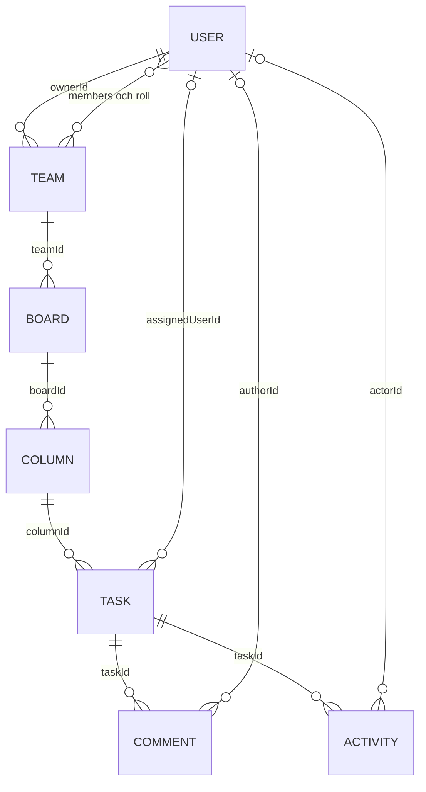

# TaskBoard

TaskBoard är ett REST-API för samarbete i team. Ett team har boards, en board har kolumner och en kolumn innehåller tasks. Användarna kan tilldela och flytta tasks, kommentera dem och följa vad som hänt i aktivitetsloggen.

Projektet använder Node.js, Express, TypeScript, MongoDB/Mongoose, Zod, bcrypt, JWT och Pino. Rekommenderad Node-version är 24. Tester körs med Jest och Supertest.

## Starta lokalt

1. Installera Node.js 24 och kör `npm ci` i projektmappen.
2. Kopiera `.env.example` till `.env`.
3. Fyll i `MONGODB_URI` för din MongoDB Atlas-databas och en slumpmässig `JWT_SECRET` med minst 32 tecken. Tillåt datorns IP-adress i Atlas och använd en separat databas för utveckling.
4. Kör `npm run dev`.

`.env` innehåller hemligheter och ska inte läggas i Git. Servern ansluter till MongoDB innan den börjar ta emot requests. Lokal adress är normalt `http://localhost:3000`.

| Kommando | Användning |
|---|---|
| `npm run dev` | Starta servern under utveckling |
| `npm test` | Kör Jest och Supertest mot en tillfällig MongoDB |
| `npm run test:coverage` | Kör samma testsvit och skapa täckningsrapport |
| `npm run test:typecheck` | Kontrollera testkodens TypeScript-typer |
| `npm run build` | Bygg TypeScript till `dist/` |
| `npm start` | Starta den byggda servern |
| `npm run migrate` | Migrera tidigare data till de nya modellfälten och teamrollerna |
| `npm run admin -- admin@example.com` | Ge ett befintligt konto global adminbehörighet |

Admin- och migreringskommandona använder databasen i `MONGODB_URI` och ändrar den. Kontrollera databasvalet först. Ta en backup före migrering av befintlig data. Adminbehörighet ges genom ett betrott driftkommando, aldrig genom registrering eller profiluppdatering.

Migreringen fyller i saknade tidsstämplar och `deletedAt`, sätter `isAdmin` till `false` för äldre användare som saknar fältet, nya taskfält till `deadline: null`/`priority: "medium"` och kolumnregler till `null`. En tidigare teamroll `admin` blir `owner`, och teamets ägar-ID fylls i från en tidigare ägare. Ett legacy-team utan identifierbar ägare behöver granskas manuellt innan migreringen kan slutföras. Befintliga fältvärden skrivs inte över med standardvärden.

Operationer som ändrar tasks, kommentarer eller kontokopplingar använder MongoDB-transaktioner. Atlas stödjer detta; en lokal MongoDB behöver köras som replica set.

### Miljövariabler

| Variabel | Användning |
|---|---|
| `PORT` | HTTP-port, normalt `3000` lokalt; molntjänsten kan ange ett eget värde |
| `MONGODB_URI` | MongoDB-anslutning med databasnamn |
| `JWT_SECRET` | Hemlig signeringsnyckel, minst 32 tecken |
| `NODE_ENV` | `development`, `test` eller `production` |
| `LOG_LEVEL` | Pino-nivå: `fatal`, `error`, `warn`, `info`, `debug`, `trace` eller `silent` |

## Modeller och relationer



| Modell | Viktiga fält |
|---|---|
| User | `name`, `email`, hashat `password`, `isAdmin`, `createdAt`, `deletedAt` |
| Team | `name`, `ownerId`, `members` med `user` och roll `owner`/`member`, `deletedAt` |
| Board | `title`, `teamId`, `deletedAt` |
| Column | `title`, `boardId`, `position`, `allowedTransitions`, `deletedAt` |
| Task | `title`, `description`, `deadline`, `priority`, `assignedUserId`, `columnId`, `deletedAt` |
| Comment | `text`, `authorId`, `taskId`, `deletedAt` och tidsstämplar |
| Activity | händelsetyp, `actorId`, `taskId`, detaljer och tidpunkt |

Modellerna har egna TypeScript-interfaces och valideras av Mongoose. API:ets indata valideras även med Zod. Behörighet till en task följer relationen Task → Column → Board → Team. Kommentarer och aktivitet kontrolleras genom sin task.

## Inloggning och roller

Vid registrering normaliseras e-postadressen och lösenordet hashas med bcrypt. Vid login jämförs lösenordet med hashen. En lyckad login ger en JWT med användarens ID som gäller i en timme.

Skicka token till alla skyddade endpoints. Ange också `Content-Type` när requesten har en JSON-body:

```text
Authorization: Bearer <token>
Content-Type: application/json
```

Middleware kontrollerar signatur, giltighetstid och ID-format. Användaren hämtas sedan från databasen på varje skyddad request. Ett borttaget konto kan därför inte fortsätta använda sin tidigare token. Lösenordshashar ingår inte i API-svar.

| Roll | Behörighet |
|---|---|
| Global admin: `User.isAdmin = true` | Åtkomst till alla aktiva team och deras resurser för support; kan även lista användare |
| Projektägare: teamroll `owner` | Hantera sitt team och dess medlemmar, boards, kolumner och tasks |
| Teammedlem: teamroll `member` | Läsa teamets innehåll, skapa/ändra/tilldela/flytta tasks och kommentera |
| Utomstående | Nekas åtkomst till teamets innehåll med `403` |

Den som skapar ett team blir dess projektägare. En tillagd användare blir teammedlem. En teamroll gör inte användaren till global admin. Registrering och `PATCH /users/me` kan inte ändra `isAdmin`. En kommentar kan ändras eller raderas av sin författare, projektägaren eller en global admin.

## Endpoints

Basadressen är `http://localhost:3000` lokalt. Förutom `/health`, `/auth/register` och `/auth/login` kräver alla endpoints JWT. `Teamåtkomst` betyder projektägare, teammedlem eller global admin. `Ägare` betyder projektägare i det aktuella teamet eller global admin.

### Health, auth och användare

| Metod | Sökväg | Behörighet och funktion |
|---|---|---|
| GET | `/health` | Publik; kontrollera att API:t svarar |
| POST | `/auth/register` | Publik; skapa konto med `name`, `email`, `password` |
| POST | `/auth/login` | Publik; `email`, `password` ger en JWT |
| GET | `/users/me` | Hämta den egna profilen |
| PATCH | `/users/me` | Ändra egna `name`, `email` och/eller `password` |
| DELETE | `/users/me` | Rensa det egna kontot; `409` om kontot äger ett aktivt team |
| GET | `/users` | Global admin; lista aktiva användare utan lösenordshashar |

Lösenord vid registrering/profiländring måste ha minst 8 tecken och högst 72 UTF-8-byte. Registrering tillåter bara `name`, `email` och `password`; ett inskickat `isAdmin`-fält nekas. API:t tar för närvarande inte emot sök-/sidindelningsparametrar i query-strängen.

### Team

| Metod | Sökväg | Behörighet och funktion |
|---|---|---|
| POST | `/teams` | Inloggad; skapa med `{ "name": "Utvecklingsteam" }` och bli owner |
| GET | `/teams` | Lista egna aktiva team; global admin kan se alla |
| GET | `/teams/:teamId` | Teamåtkomst; hämta ett team |
| PATCH | `/teams/:teamId` | Ägare; ändra `name` |
| DELETE | `/teams/:teamId` | Ägare; mjukradera teamet |
| POST | `/teams/:teamId/members` | Ägare; lägg till befintlig användare med `email` |
| DELETE | `/teams/:teamId/members/:userId` | Ägare; ta bort teammedlemskap och användarens task-tilldelningar i teamet |

Projektägaren kan inte tas bort genom medlems-endpointen. Ägarbyte stöds inte. För att rensa ett ägarkonto måste dess aktiva team först mjukraderas.

### Boards och kolumner

| Metod | Sökväg | Behörighet och funktion |
|---|---|---|
| POST | `/teams/:teamId/boards` | Ägare; skapa med `title` |
| GET | `/teams/:teamId/boards` | Teamåtkomst; lista boards |
| GET | `/boards/:boardId` | Teamåtkomst; hämta en board |
| PATCH | `/boards/:boardId` | Ägare; ändra `title` |
| DELETE | `/boards/:boardId` | Ägare; mjukradera boarden |
| POST | `/boards/:boardId/columns` | Ägare; skapa med `title`, `position` och valfritt `allowedTransitions` |
| GET | `/boards/:boardId/columns` | Teamåtkomst; lista kolumner efter position |
| GET | `/columns/:columnId` | Teamåtkomst; hämta en kolumn |
| PATCH | `/columns/:columnId` | Ägare; ändra `title`, `position` och/eller `allowedTransitions` |
| DELETE | `/columns/:columnId` | Ägare; mjukradera tom kolumn; `409` om aktiva tasks finns |

Kolumnens `position` ska vara ett heltal från 0 och uppåt. Flytta eller mjukradera dess aktiva tasks innan kolumnen tas bort.

### Tasks

| Metod | Sökväg | Behörighet och funktion |
|---|---|---|
| POST | `/columns/:columnId/tasks` | Teamåtkomst; skapa task |
| GET | `/columns/:columnId/tasks` | Teamåtkomst; lista aktiva tasks i kolumnen |
| GET | `/tasks/:taskId` | Teamåtkomst; hämta en task |
| PATCH | `/tasks/:taskId` | Teamåtkomst; ändra titel, beskrivning, deadline, prioritet eller tilldelning |
| PATCH | `/tasks/:taskId/move` | Teamåtkomst; flytta med `{ "columnId": "destinationens-id" }` |
| DELETE | `/tasks/:taskId` | Ägare; mjukradera tasken |

En tilldelad användare måste vara medlem i taskens team. `assignedUserId: null` tar bort tilldelningen. `priority` är `low`, `medium` eller `high` och är normalt `medium`. `deadline` är en ISO 8601-tidsstämpel med tidszon eller `null`; utelämnat värde blir `null`.

Exempel när en task skapas:

```json
{
  "title": "Utveckla aktivitetsloggen",
  "description": "Registrera ändringar och tilldelningar",
  "deadline": "2026-10-09T12:00:00.000Z",
  "priority": "high",
  "assignedUserId": null
}
```

Flyttregler finns på kolumnen som tasken lämnar. Ändra reglerna med `PATCH /columns/:columnId`:

| `allowedTransitions` | Tillåtna destinationer |
|---|---|
| `null` | Alla aktiva kolumner inom samma team, även på en annan board |
| `["kolumn-id"]` | Bara aktiva kolumner i listan; listan får ange kolumner på samma board |
| `[]` | Inga flyttar ut ur kolumnen |

För Todo → In Progress → Done sätter projektägaren Todos lista till In Progress-kolumnens ID och In Progress-listan till Done-kolumnens ID. En flytt som nekas av listan får `409`. Flytt till ett annat team är alltid förbjuden och ger `403`.

### Kommentarer och aktivitet

| Metod | Sökväg | Behörighet och funktion |
|---|---|---|
| POST | `/tasks/:taskId/comments` | Teamåtkomst; skapa kommentar med `text` |
| GET | `/tasks/:taskId/comments` | Teamåtkomst; lista kommentarer |
| GET | `/comments/:commentId` | Teamåtkomst; hämta en kommentar |
| PATCH | `/comments/:commentId` | Författare/ägare/admin; ändra `text` |
| DELETE | `/comments/:commentId` | Författare/ägare/admin; mjukradera kommentaren |
| GET | `/tasks/:taskId/activities` | Teamåtkomst; läs taskens aktivitetslogg |

Aktivitet skapas automatiskt när en task skapas, uppdateras, tilldelas, flyttas eller kommenteras. Det finns inga publika endpoints för att skapa, redigera eller radera aktivitet. Loggen sparar händelser och relevanta ID:n/fältnamn, inte kopior av användarnas lösenord eller fritext.

## Radering och personuppgifter

Team, Board, Column, Task och Comment mjukraderas med `deletedAt`. De finns kvar i MongoDB men visas inte i vanliga API-listor. En borttagen resurs eller ett innehåll under en borttagen förälder går inte att använda genom API:t och ger `404`. Global admin får inte kringgå mjukraderingen.

Att ta bort en medlem ur ett team tar bort medlemskapet och task-tilldelningarna i det teamet. Kontot, kommentarerna och den tidigare aktivitetens författarkopplingar finns kvar. Det är en ändring av åtkomst, inte en begäran om att radera hela kontots personuppgifter.

`DELETE /users/me` ersätter kontots namn och e-post, gör lösenordet oanvändbart, tar bort adminbehörighet och alla medlemskap/tilldelningar samt rensar användarens författarkopplingar och kommentarstext. Aktivitetens händelser finns kvar med `actorId: null`. Läs [GDPR.md](GDPR.md) för exakt omfattning och begränsningar.

## Validering, fel och loggning

Zod validerar JSON, URL-parametrar och tillåtna fält. Mongoose validerar modellernas fält och relationernas ID:n. Egna felklasser och gemensam felmiddleware ger konsekventa JSON-fel. Interna fel och stacktraces skickas inte till klienten.

| Status | Betydelse |
|---|---|
| `200` / `201` | Requesten lyckades / en resurs skapades |
| `400` | Ogiltig indata |
| `401` | Token saknas, är ogiltig/utgången eller kontot har tagits bort |
| `403` | Otillräcklig behörighet eller flytt till ett annat team |
| `404` | Resursen saknas eller är mjukraderad |
| `409` | Konflikt: exempelvis befintlig e-post, förbjuden kolumnövergång, icke-tom kolumn eller konto som äger aktivt team |
| `500` | Ett oväntat serverfel |

Pino loggar drift- och requestinformation. Lösenord, JWT, Authorization-header och MongoDB-anslutningssträng ska inte hamna i loggar. Request-body och användarnas fritext skrivs inte ut som driftlogg.

## Tester och verifiering

Kör `npm test` och därefter `npm run build`. Jest/Supertest anropar det riktiga Express-API:t med ett tillfälligt MongoDB-replica set via `mongodb-memory-server`. Sviten innehåller tester för CRUD, roller, teamisolering, flyttregler, kommentarer, aktivitet, mjukradering, validering, säker loggning och kontorensning. Testdatabasen är separat från Atlas. Första testkörningen kan behöva hämta MongoDB-binären.

Testerna verifierar inte din Atlas-konfiguration eller en molndriftsättning. Kontrollera dessa separat med syntetiska projektdata i en avsedd testdatabas. Bekräfta att sparade fält, kommentarer, aktivitet och `deletedAt` finns i MongoDB och att behörigheterna gäller för varje roll. `/health` visar att API:t svarar; det är inte en kontroll av aktuell databasanslutning.

## Driftsättning på Render med MongoDB Atlas

`render.yaml` förbereder en native Node-webbtjänst: Node 24, build `npm ci && npm run build`, start `npm start` och health check `/health`. `NPM_CONFIG_INCLUDE=dev` behåller TypeScript-verktygen under bygget även med `NODE_ENV=production`. Konfigurationen använder free-plan och manuell driftsättning.

1. Koppla Git-repot till en Render Blueprint och välj projektets `render.yaml`.
2. Ange `MONGODB_URI` och en egen `JWT_SECRET` i Render. De har `sync: false` och finns inte i filen.
3. Tillåt tjänstens utgående IP-adresser i Atlas och kontrollera databasbehörigheten.
4. Kör eventuell legacy-migrering mot rätt databas från en betrodd miljö. Skapa önskat admin-konto och kör admin-kommandot separat vid behov.
5. Driftsätt och verifiera `/health`, login och ett helt flöde mot den URL som Render faktiskt tilldelar tjänsten. En health-respons ersätter inte kontrollen av databaslagring.

Det finns ingen verifierad live-URL dokumenterad här ännu. Lägg till den först när tjänsten har driftsatts och kontrollerats.

Konfigurationsreferenser: [Render Blueprint](https://render.com/docs/blueprint-spec), [Node-version på Render](https://render.com/docs/node-version) och [npm include](https://docs.npmjs.com/cli/v11/using-npm/config#include).

## Git och granskning

Arbeta på en branch per större funktion och öppna en pull request mot `main` före merge. PR-mallen i `.github/PULL_REQUEST_TEMPLATE.md` innehåller kontroll av tester, build, behörigheter, felhantering och hemligheter.
